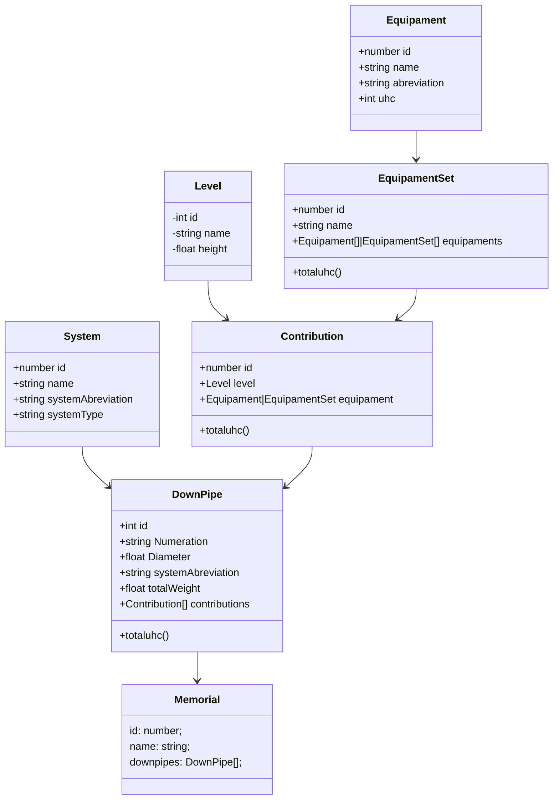

# Memorial de Prumadas Hidrossanitárias

Esta aplicação tem como objetivo **automatizar a criação de memoriais descritivos** para sistemas hidráulicos e sanitários em edificações verticais.  
Ela foi desenvolvida usando **React**, **TypeScript** e **TailwindCSS**, com persistência local por meio de `localStorage` ou tecnologias semelhantes.

> Preencher memoriais de forma manual é repetitivo, sujeito a erros e pouco produtivo. Esta ferramenta visa simplificar esse processo com modelagem de dados estruturada e interface amigável.

---

## ✨ Tecnologias

- **React + Vite**
- **TypeScript**
- **Tailwind CSS**
- **IndexedDB** via `Dexie.js`
- **Toast notifications** via [`sonner`](https://github.com/emilkowalski/sonner)

---

## 🚀 Uso

```bash
git clone https://github.com/tiagolimar/fd-hidro.git
cd fd-hidro
npm i
npm run dev
```

---

## 🧹 Convenção de Código

O projeto utiliza indentação de **4 espaços**. Execute `eslint --fix` antes de enviar contribuições para garantir que os arquivos estejam no padrão. Recomendamos a extensão [EditorConfig for VS Code](https://marketplace.visualstudio.com/items?itemName=EditorConfig.EditorConfig) ou equivalente para salvar automaticamente com 4 espaços.

---

## 📐 Modelagem dos Componentes

A estrutura de dados foi modelada para representar com fidelidade os elementos do dimensionamento de prumadas. As principais entidades são:



- **System** – agrupa os conjuntos de tubulações de um mesmo tipo (água fria, esgoto, etc.).
- **DownPipe** – representa a prumada em si, com suas contribuições de equipamentos em cada pavimento.
- **Equipament** – ponto de consumo individual (pia, chuveiro...).
- **EquipamentSet** – coleção reutilizável de equipamentos com quantidade.
- **Level** – pavimento da edificação.
- **Contribution** – ligação entre `Level` e `Equipament`/`EquipamentSet`, utilizada para calcular o total de UHC da prumada.
- **Memorial** – memorial descritivo final com todas as prumadas.


## 📂 Estrutura do Projeto

```
src/
├─ components/       # componentes reutilizáveis de interface
├─ db/               # configuração do Dexie e instância do banco
├─ dto/              # objetos de transferência usados para persistência
├─ models/           # classes de domínio
├─ pages/            # páginas de listagem/edição
├─ repositories/     # camada de acesso a dados
├─ routes/           # definição das rotas React Router
├─ seeds/            # dados iniciais inseridos no IndexedDB
└─ tests/            # testes unitários com Vitest
```

Documentação detalhada de cada camada está disponível na pasta [`doc/`](doc/README.md).

## 🧪 Testes

Execute os testes unitários com o comando:

```bash
npm test
```

## 👤 Autor

Desenvolvido por [tiagolimar](https://github.com/tiagolimar/) · [LinkedIn](https://www.linkedin.com/in/tiago-limar/)
