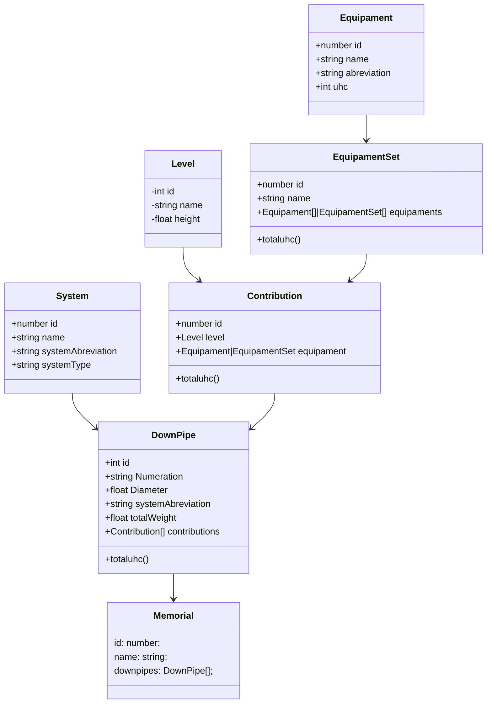

# Memorial de Prumadas Hidrossanitárias

Esta aplicação tem como objetivo **automatizar a criação de memoriais descritivos** para sistemas hidráulicos e sanitários em edificações verticais.  
Ela foi desenvolvida usando **React**, **TypeScript** e **TailwindCSS**, com persistência local por meio de `localStorage` ou tecnologias semelhantes.

> Preencher memoriais de forma manual é repetitivo, sujeito a erros e pouco produtivo. Esta ferramenta visa simplificar esse processo com modelagem de dados estruturada e interface amigável.

---

## ✨ Tecnologias

- **React + Vite**
- **TypeScript**
- **Tailwind CSS**
- **localStorage** ou `IndexedDB` (futuramente com `Dexie.js`)
- **Mermaid.js** para modelagem visual

---

## 🧹 Convenção de Código

O projeto utiliza indentação de **4 espaços**. Execute `eslint --fix` antes de enviar contribuições para garantir que os arquivos estejam no padrão. Recomendamos a extensão [EditorConfig for VS Code](https://marketplace.visualstudio.com/items?itemName=EditorConfig.EditorConfig) ou equivalente para salvar automaticamente com 4 espaços.

---

## 📐 Modelagem dos Componentes

A estrutura de dados foi modelada para representar com fidelidade os elementos do dimensionamento de prumadas.



## 🧪 Testes

Execute os testes unitários com o comando:

```bash
npm test
```
